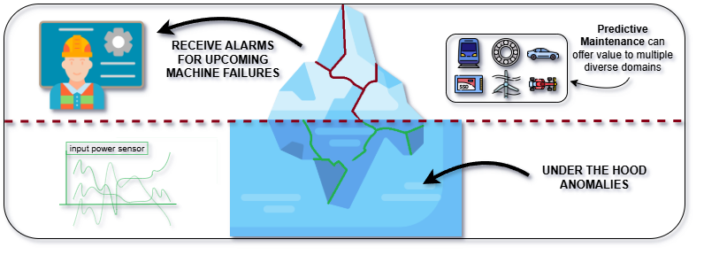

<h2 align="center">
(SIGMOD'26) The Power of Anomaly Detection in Predictive Maintenance



</h2>

---

If you find our work useful please consider citing and giving a star :smiley:

```

```

Please let us know if you find out a mistake or have any issues!

Full text plus Appendix is available [here](TSAD_for_PdM_Revised.pdf).

## Reproducibility Guide

Below are the steps to set up the environment, execute the experiments, visualize the results, and reproduce figures found in the manuscript.

### 1. Data Setup

Before running any code, ensure the data is placed correctly:

1.  Download the repository.
2.  Extract the provided `DataFolder.zip` from [here](https://drive.google.com/file/d/1BqQdim59HXSXtn2QPkSylyN8cK5O2QfE/view?usp=sharing).
3.  Place the extracted directory into `tsad-for-pdm-study-sigmod-2026/src/pdm-evaluation/`.

> **Note:** The final structure should look like: `src/pdm-evaluation/DataFolder`.

### 2. Environment Installation

We use Anaconda to manage dependencies. Open your terminal and run the following commands to create and activate the environment:

```bash
# Navigate to the repository root
cd tsad-for-pdm-study-sigmod-2026

# Create the environment from the provided file
conda env create --file environment.yml

# Activate the environment
conda activate PdM-Evaluation
```

> **Note:** CHRONOS (and CHRONOS-2) require a different Anaconda environment (environment_chronos.yml and environment_autogluon150.yml) due to different CUDA and PyTorch needs than the other Deep Learning models. You will need to manually install the CHRONOS package after creating the CHRONOS-related environment using the following command.

```
pip install chronos-forecasting==1.3.0
```

> **Note:** TIME-LLM also requires a different Anaconda environment (environment_timellm.yml).

For the rest of Deep Learning models (LTSF, TIMEMIXER++, TRANAD, USAD) and the default environment, we have used PyTorch 1.9.0 with CUDA 11.1, but this also depends on the GPU you have available.

### 3. Running Experiments

To execute the Time Series Anomaly Detection (TSAD) experiments:

```bash
# Navigate to the source directory
cd src/pdm-evaluation/

# Run the main execution script
python main.py
```

> **Configuration Details:**
>
> Default Behavior: By default, main.py executes experiments for the IMS dataset using the unsupervised flavor.
>
> Custom Configurations: Configuration files are located in src/pdm-evaluation/experimental_runs_configuration. These are grouped by dataset and flavor.
>
> Example: experimental_runs_configuration/ims/run_online.py contains the implementation for the IMS dataset with the online flavor.
>
> Running Other Experiments: To reproduce a different experiment, modify main.py to import the associated experimental configuration file for your desired dataset/flavor and adjust the evaluated TSAD techniques accordingly.

Executing the above will start tracking the results with MLflow (see below). Once the experiments are completed you can query
the results through the `analysis_scripts/data_analysis_runtime.py` script using `python data_analysis_runtime.py`. We have
already queried our experiments and the results (except those about randomized smoothing, which concern the raw anomaly scores rather than
the evaluation metrics) can be found in `analysis_scripts/data_analysis_runtime.csv`.

To execute an adversarial noise experiment:

```bash
python edp_adversarial.py --method $METHOD --mode noise --sigma $SIGMA --seed 42
```

and an adversarial out-of-order experiment:

```bash
python edp_adversarial.py --method $METHOD --mode out_of_order --max_lag $MAX_LAG --prob $PROB --seed 42
```

To execute a randomized smoothing experiment (we used 100 different seeds starting from 2026, MA_FLAG can be empty or --moving_average):

```bash
python edp_randomized_smoothing.py --method $METHOD --sigma $SIGMA --seed 2026 $MA_FLAG
```

and a median smoothing experiment (after 100 completed randomized smoothing experiments):

```bash
python edp_median_smoothing_experiment.py --method $METHOD --seed 42
```

### 4. Experiment Tracking

We utilized MLflow for experiment tracking. Due to their size (> 100 GB), MLflow records and associated data can be provided on demand.

You can use MLflow to observe experimental results in real-time or post-execution. Open a new terminal window and run:

```bash
cd tsad-for-pdm-study-sigmod-2026/src/pdm-evaluation
conda activate PdM-Evaluation

# Start the MLflow server
mlflow server --host 127.0.0.1 --port 8080
```

Open your browser and navigate to http://127.0.0.1:8080.

Select the experiment you are interested in from the left sidebar.

### 5. Reproducing Figures and Analysis

The **_analysis_scripts_** folder contains the results of all conducted experiments (**_data_analysis_runtime.csv_**) and the scripts required to generate the figures presented in the manuscript.

You will additionally need to install the visualization and ranking libraries required for these scripts:

```bash
cd tsad-for-pdm-study-sigmod-2026/analysis_scripts

conda activate PdM-Evaluation

pip install seaborn autorank paretoset choix
```

Then for reproducing a figure, execute the associated script from the following table.

| Manuscript Artifact                                       | Script Name                                    | Command                                               |
| :-------------------------------------------------------- | :--------------------------------------------- | :---------------------------------------------------- |
| **Figure 3**                                              | `critical_difference_diagrams.py`              | `python critical_difference_diagrams.py`              |
| **Figures 4, B.1**                                        | `data_analysis_runtime.py`                     | `python data_analysis_runtime.py analysis`            |
| **Figure 5**                                              | `runtime_analysis_2d_plot.py`                  | `python runtime_analysis_2d_plot.py`                  |
| **Figure 6**                                              | `critical_diagrams_runtime.py`                 | `python critical_diagrams_runtime.py`                 |
| **Figure 7**                                              | See below                                      |                                                       |
| **Figure 8**                                              | `adversarial_robustness.py`                    | `python adversarial_robustness.py`                    |
| **Figure B.2**                                            | `pareto_frontier.py`                           | `python pareto_frontier.py`                           |
| **Figures B.3, B.4**                                      | `critical_difference_diagrams_flavor_level.py` | `python critical_difference_diagrams_flavor_level.py` |
| **Figure B.5**                                            | `critical_diagrams_runtime_global.py`          | `python critical_diagrams_runtime_global.py`          |
| **Figure B.6**                                            | `grouped_heatmap.py`                           | `python grouped_heatmap.py`                           |
| **Tables 5, B.3, B.4, B.5**                               | `extract_boxplots.py`                          | `python extract_boxplots.py`                          |
| **Table 6**                                               | `edp_individual_injected_into_evaluation.py`   | `python edp_individual_injected_into_evaluation.py`   |
| **Tables B.1, B.2**                                       | `generate_llm_tables.py`                       | `python generate_llm_tables.py`                       |
| **Table B.6**                                             | `median_ranking.py`                            | `python median_ranking.py`                            |
| **Table B.7 (ranking)**                                   | `phr_proxy.py`                                 | `python phr_proxy.py`                                 |
| **Table B.7 (Phr)**                                       | `phr_statistics_eval.py`                       | `python phr_statistics_eval.py`                       |
| **Tables B.8-B.15 (METRIC variable needs to be changed)** | `worst_to_best_gap.py`                         | `python worst_to_best_gap.py`                         |
| **Table B.16**                                            | `comparison_with_add.py`                       | `python comparison_with_add.py`                       |
| **Table B.17**                                            | `median_smoothing_table.py`                    | `python median_smoothing_table.py`                    |

For Figure 7 you will need to execute the following:

```bash
cd src/pdm-evaluation/explainability/EDP

python combine.py

cd ..

python show.py
```

---

## For Windows OS

#### Download and install MSYS2:

Visit the MSYS2 website and download the installer.
Run the installer and follow the installation instructions.

#### Update MSYS2:

After installing, open the MSYS2 shell from the Start Menu and update the package database and the core system packages by running:

```sh
pacman -Syu
```

If it asks you to close the terminal and re-run the command, do so.

#### Install GCC:

Once MSYS2 is updated, you can install the GCC package. Open the MSYS2 shell again and run:

```sh
pacman -S mingw-w64-x86_64-gcc
```

This command installs the GCC compiler for the x86_64 architecture.

#### Add GCC to your system path:

This needs to run in every new terminal session.

```commandline
$env:Path += ';C:\msys64\mingw64\bin'
```

#### Install make command

Visit: https://gnuwin32.sourceforge.net/packages/make.htm

This needs to run in every new terminal session.

```commandline
$env:Path += ';C:\Program Files (x86)\GnuWin32\bin'
```

#### Creating the Anaconda environment

```
conda env create --file environment_windows.yml
conda activate PdM-Evaluation
```
